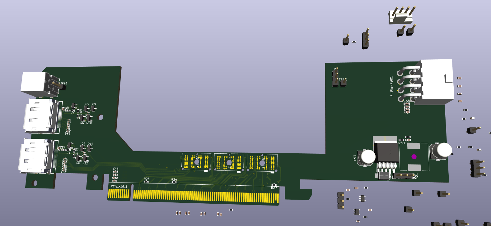
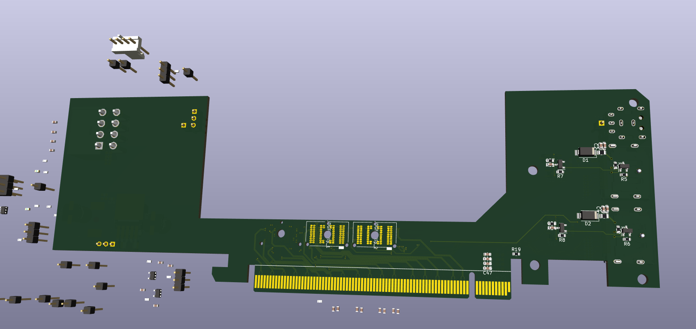

# DGFF Immobilizer

A DGFF to PCIe adapter, based on my work on MXM Immobilizer (DGFF is just funny MXM)

Still extremely experimental and not anywhere near ready for use or testing  
DGFF pinouts taken from Dell Precision 7740 LA-H281P and Area51M LA-G881P boards  
The DGFF footprint's dimensions are unlikely to be accurate, it has been recreated from pixel measurements of a high-resolution image of a DGFF card. In any case they do not match the likely more accurate Framework Laptop 16"'s FXBeam footprint available elsewhere.  
This adapter is designed so far to work with Dell Precision and Alienware cards, their pinouts seem to be mostly identical but mirrored, so the Alienware one connects on the back side.  

I don't think I'll be finishing this project anytime soon, but maybe it can be a useful resource for others experimenting with DGFF

